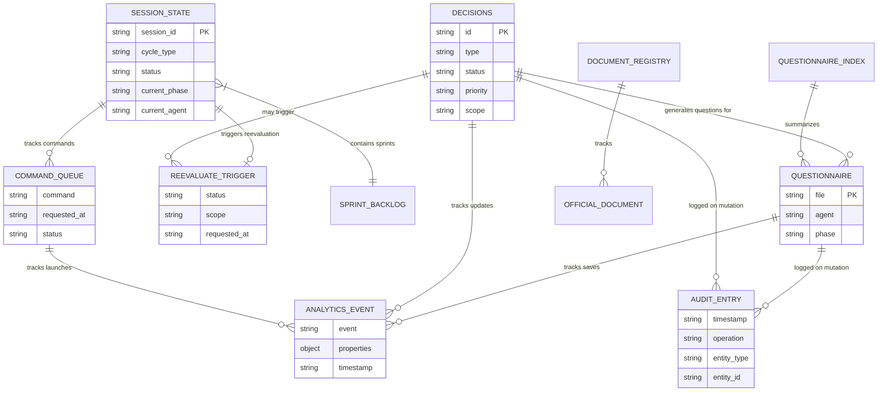

# Data Dictionary — Agentic IT Project Team

> Version 1.0 | Last updated: 2026-03-08 | Source: SP-R2-007-004

This document catalogues all data entities, their schemas, relationships, file locations, and field descriptions.

---

## Table of Contents

1. [Entity Catalog](#entity-catalog)
2. [Entity Details](#entity-details)
3. [Entity Relationship Diagram](#entity-relationship-diagram)
4. [File Naming Conventions](#file-naming-conventions)
5. [Validation Rules](#validation-rules)

---

## Entity Catalog

| Entity | Type | Location | Schema Validator |
|--------|------|----------|-----------------|
| Session State | JSON | `.github/docs/session/session-state.json` | `schemas.validateSessionState()` |
| Command Queue | JSON | `.github/docs/session/command-queue.json` | `schemas.validateCommandQueue()` |
| Decisions | Markdown | `.github/docs/decisions.md` | `models.parseDecisions()` |
| Questionnaires | Markdown | `BusinessDocs/Phase[N]-*/Questionnaires/*.md` | `models.parseQuestionnaire()` |
| Questionnaire Index | Markdown | `BusinessDocs/questionnaire-index.md` | `models.parseIndex()` |
| Analytics Events | JSON | `.github/docs/analytics-events.json` | Server-side event type validation |
| Audit Log | JSONL | `.github/docs/audit/audit.jsonl` | `audit.js` internal validation |
| Reevaluate Trigger | JSON | `.github/docs/session/reevaluate-trigger.json` | Inline validation in server.js |
| Help Content | Markdown | `.github/help/*.md` | Filesystem scan, slug validation |
| Official Documents | Markdown | `BusinessDocs/OfficialDocuments/*.md` | N/A (freeform content) |
| Document Registry | Markdown | `BusinessDocs/OfficialDocuments/document-registry.md` | N/A |

---

## Entity Details

### 1. Session State

**File:** `.github/docs/session/session-state.json`
**Format:** JSON object
**Validator:** `schemas.validateSessionState()` (schemas.js)

| Field | Type | Required | Description |
|-------|------|----------|-------------|
| `session_id` | string | Yes | Unique session identifier (e.g., `"sess-20260308-001"`) |
| `cycle_type` | string | Yes | One of 11 values: `FULL_CREATE`, `PARTIAL_CREATE`, `COMBO_CREATE`, `FULL_AUDIT`, `PARTIAL_AUDIT`, `COMBO_AUDIT`, `FEATURE`, `REEVALUATE`, `SCOPE_CHANGE`, `HOTFIX`, `REFRESH` |
| `status` | string | Yes | Pipeline status: `NOT_STARTED`, `ONBOARDING`, `PHASE-1-IN-PROGRESS`, `PHASE-2-IN-PROGRESS`, `PHASE-3-IN-PROGRESS`, `PHASE-4-IN-PROGRESS`, `SYNTHESIS`, `SPRINT-IN-PROGRESS`, `COMPLETE` |
| `current_phase` | string | No | Active phase key: `ONBOARDING`, `PHASE-1` through `PHASE-5`, `SYNTHESIS` |
| `current_agent` | string | No | Active agent ID (e.g., `"05-software-architect"`, `"20-implementation-agent"`) |
| `current_step` | string | No | Human-readable description of current step |
| `initiated_at` | string | No | ISO 8601 timestamp of session start |
| `last_updated` | string | No | ISO 8601 timestamp of last state change |
| `completed_phases` | string[] | No | Array of completed phase keys |
| `completed_agents` | string[] | No | Array of completed agent IDs |
| `phase_outputs` | object | No | Map of phase keys to output file paths or agent-output maps |
| `sprint_backlog` | object | No | Map of sprint IDs to sprint state objects |
| `current_sprint` | string | No | Active sprint ID (e.g., `"SP-R2-007"`) |
| `sprint_branch` | string | No | Git branch name for current sprint |

### 2. Command Queue

**File:** `.github/docs/session/command-queue.json`
**Format:** JSON array of command entry objects
**Validator:** `schemas.validateCommandQueue()` / `schemas.validateCommandEntry()` (schemas.js)

| Field | Type | Required | Description |
|-------|------|----------|-------------|
| `command` | string | Yes | The command text (e.g., `"CREATE MyProject"`, `"CONTINUE"`) |
| `requested_at` | string | Yes | ISO 8601 timestamp of when command was queued |
| `status` | string | Yes | One of: `PENDING`, `PROCESSING`, `DONE`, `ERROR` |
| `project` | string | No | Project name extracted from command |
| `description` | string | No | For FEATURE commands: feature description |
| `scope` | string | No | For REEVALUATE/SCOPE CHANGE: affected scope |

### 3. Decisions

**File:** `.github/docs/decisions.md`
**Format:** Markdown with three table sections
**Parser:** `models.parseDecisions()` (models.js)

**Returns:** `{ open: Decision[], decided: Decision[], deferred: Decision[] }`

#### Open Question Fields

| Field | Type | Source Column | Description |
|-------|------|---------------|-------------|
| `id` | string | ID | Decision ID (e.g., `DEC-R2-010`) |
| `type` | string | — | Always `"OPEN_QUESTION"` |
| `status` | string | — | Always `"OPEN"` |
| `priority` | string | Priority | `HIGH`, `MEDIUM`, or `LOW` |
| `scope` | string | Scope | Phase/sprint/agent scope |
| `question` | string | Question | The question text |
| `answer` | string | Your answer | User's answer (empty if unanswered) |
| `date` | string | Date | Date of entry (YYYY-MM-DD) |

#### Decided Item Fields

| Field | Type | Source Column | Description |
|-------|------|---------------|-------------|
| `id` | string | ID | Decision ID (e.g., `DEC-T-001`, `DEC-R2-001`, `DEC-102`) |
| `type` | string | — | Always `"DECIDED"` |
| `status` | string | — | Always `"DECIDED"` |
| `priority` | string | Priority | `HIGH`, `MEDIUM`, or `LOW` |
| `scope` | string | Scope | Phase/sprint/agent scope |
| `decision` | string | Decision | The decision text |
| `notes` | string | Notes | Additional context |
| `date` | string | Date | Date of decision (YYYY-MM-DD) |

**Subsections in Decided Items:**
- `### Transformation Decisions (DEC-T series)` — DEC-T-NNN IDs
- `### Reevaluation Decisions (DEC-R2 series)` — DEC-R2-NNN IDs
- `### Operational Decisions` — DEC-NNN IDs

#### Deferred/Expired Item Fields

| Field | Type | Source Column | Description |
|-------|------|---------------|-------------|
| `id` | string | ID | Decision ID |
| `type` | string | — | `"OPEN_QUESTION"` (deferred) or `"DECIDED"` (expired) |
| `status` | string | Status | `DEFERRED` or `EXPIRED` |
| `scope` | string | Scope | Affected scope |
| `subject` | string | Subject | What was deferred/expired |
| `reason` | string | Reason | Why it was deferred/expired |
| `date` | string | Date | Date of action |

### 4. Questionnaires

**Files:** `BusinessDocs/Phase[N]-[Discipline]/Questionnaires/[NN]-[agent]-questionnaire.md`
**Format:** Markdown with structured question blocks
**Parser:** `models.parseQuestionnaire()` (models.js)

#### Questionnaire Metadata (parsed from header)

| Field | Type | Description |
|-------|------|-------------|
| `file` | string | Relative path from BusinessDocs/ |
| `agent` | string | Agent name (e.g., `"Software Architect"`) |
| `phase` | string | Phase name (e.g., `"Phase 2"`) |
| `version` | string | Document version |
| `generated` | string | Generation date |

#### Question Fields

| Field | Type | Description |
|-------|------|-------------|
| `id` | string | Unique question ID (e.g., `Q-05-001`) |
| `required` | boolean | `true` if marked `[REQUIRED]`, `false` if `[OPTIONAL]` |
| `section` | string | Section heading under which the question appears |
| `question` | string | The full question text |
| `why` | string | Explanation of why the answer is needed |
| `format` | string | Expected answer format |
| `example` | string | Example answer |
| `answer` | string | User's answer (empty if unanswered) |
| `status` | string | `OPEN` or `ANSWERED` |

**Question ID format:** `Q-[AgentNumber]-[SequentialNumber]` (e.g., `Q-05-001` = Software Architect, question 1)

### 5. Questionnaire Index

**File:** `BusinessDocs/questionnaire-index.md`
**Format:** Markdown with summary tables
**Parser:** `models.parseIndex()` (models.js)

Tracks the status of all questionnaires: total questions, answered count, required vs optional distribution.

### 6. Analytics Events

**File:** `.github/docs/analytics-events.json`
**Format:** JSON array
**Validation:** Server-side event type allowlist

| Field | Type | Required | Description |
|-------|------|----------|-------------|
| `event` | string | Yes | Event type (see valid types below) |
| `properties` | object | No | Event-specific properties |
| `timestamp` | string | Yes | ISO 8601 timestamp (added by server) |

**Valid event types:**
`page_view`, `tab_switch`, `command_launch`, `questionnaire_save`, `decision_update`, `error_displayed`, `feature_usage`, `session_start`, `session_end`

### 7. Audit Log

**File:** `.github/docs/audit/audit.jsonl`
**Format:** JSON Lines (one JSON object per line)
**Module:** `audit.js` (AuditTrail class)

| Field | Type | Required | Description |
|-------|------|----------|-------------|
| `timestamp` | string | Yes | ISO 8601 timestamp with milliseconds |
| `operation` | string | Yes | Mutation type (e.g., `UPDATE_ANSWER`, `CREATE_DECISION`, `DECIDE`) |
| `entity_type` | string | Yes | Data entity affected (e.g., `questionnaire`, `decision`) |
| `entity_id` | string | No | Specific entity ID (e.g., `Q-05-001`, `DEC-R2-010`) |
| `user` | string | No | Actor identifier (default: `"webapp"`) |
| `summary` | string | No | Human-readable description of the mutation |

**Rotation:** File rotates when exceeding max size (default: 10 MB). Rotated file renamed to `audit-[timestamp].jsonl`.

### 8. Reevaluate Trigger

**File:** `.github/docs/session/reevaluate-trigger.json`
**Format:** JSON object
**Created by:** `POST /api/reevaluate`

| Field | Type | Required | Description |
|-------|------|----------|-------------|
| `status` | string | Yes | Always `"PENDING"` when created |
| `scope` | string | Yes | Reevaluation scope: `ALL`, `BUSINESS`, `TECH`, `UX`, `MARKETING` |
| `requested_at` | string | Yes | ISO 8601 timestamp |

### 9. Help Content

**Files:** `.github/help/*.md`
**Format:** Markdown
**Access:** `GET /api/help?topic=[slug]`

Help topics are discovered by scanning the help directory. Each `.md` file becomes a topic with:
- **slug** — filename without extension (e.g., `getting-started`)
- **title** — extracted from first `# heading` in the file
- **content** — full Markdown content

Slug validation prevents path traversal (only alphanumeric and hyphens allowed).

---

## Entity Relationship Diagram

### Relationship Summary

| From | To | Relationship | Description |
|------|----|-------------|-------------|
| Session State | Command Queue | 1:N | Session tracks queued commands |
| Session State | Reevaluate Trigger | 1:0..1 | Session may have one pending reevaluation |
| Decisions | Questionnaires | N:M | Agent `INSUFFICIENT_DATA` items become questionnaire questions; answered questions may resolve decisions |
| Questionnaires | Audit Log | 1:N | Each questionnaire save creates an audit entry |
| Decisions | Audit Log | 1:N | Each decision mutation creates an audit entry |
| Questionnaire Index | Questionnaires | 1:N | Index summarizes all questionnaire statuses |
| Document Registry | Official Documents | 1:N | Registry tracks all official document completeness |

---

## File Naming Conventions

| Pattern | Example | Description |
|---------|---------|-------------|
| `[NN]-[agent-name]-questionnaire.md` | `05-software-architect-questionnaire.md` | Questionnaire files, NN = agent number |
| `Phase[N]-[Discipline]/` | `Phase2-Tech/` | Phase directories in BusinessDocs |
| `session-state.json` | — | Always this exact name |
| `command-queue.json` | — | Always this exact name |
| `decisions.md` | — | Always this exact name |
| `analytics-events.json` | — | Always this exact name |
| `audit.jsonl` | — | Default audit log filename |
| `audit-[ISO-timestamp].jsonl` | `audit-2026-03-08T120000.jsonl` | Rotated audit log |
| `reevaluate-trigger.json` | — | Always this exact name |
| `[slug].md` | `getting-started.md` | Help content files |
| `[document-name].md` | `technical-overview.md` | Official documents |
| `Q-[NN]-[NNN]` | `Q-05-001` | Question IDs: agent number + sequential |
| `DEC-[series]-[NNN]` | `DEC-R2-001`, `DEC-T-005` | Decision IDs by series |
| `SP-R2-[NNN]` | `SP-R2-007` | Sprint IDs |

---

## Validation Rules

### Session State (schemas.js → `validateSessionState`)
- `session_id`: must be string
- `cycle_type`: must be string
- `status`: must be string
- `current_phase`, `current_agent`, `initiated_at`, `last_updated`: optional strings
- `completed_phases`, `completed_agents`: optional arrays

### Command Entry (schemas.js → `validateCommandEntry`)
- `command`: required string
- `requested_at`: required string (ISO 8601)
- `status`: required, must be one of `PENDING`, `PROCESSING`, `DONE`, `ERROR`
- `project`, `description`, `scope`: optional strings

### Analytics Events (server.js → inline validation)
- `events` array: required, must have 1–100 items
- Each event `event` field: must be in the allowlist (9 types)
- `properties`: optional object

### Questionnaire Answers (server.js → `apiSave`)
- `file`: required string, must resolve to a valid path within BusinessDocs/
- `updates`: required array, 1–50 items
- Each update: `questionId` (string), `answer` (string), `status` (string)
- Answer text run through `detectSecrets()` — warnings attached if patterns found
- Answer text run through `sanitizeMarkdown()` before insertion

### Decisions (server.js → `apiPostDecision`)
- `action`: required, must be one of `create`, `answer`, `decide`, `defer`
- For `create`: `type`, `priority`, `scope`, `text` required
- For `answer`/`decide`/`defer`: `id` required
- Answer/decision text run through `sanitizeMarkdown()` and `detectSecrets()`

### Path Validation (server.js → `safePath`)
- All file paths validated against path traversal (`..`)
- Must resolve within the expected base directory
- Throws on violation (HTTP 403)

### Help Slugs (server.js → `apiGetHelp`)
- Must match `/^[a-z0-9-]+$/` — only lowercase alphanumeric and hyphens
- Invalid slugs return HTTP 400
